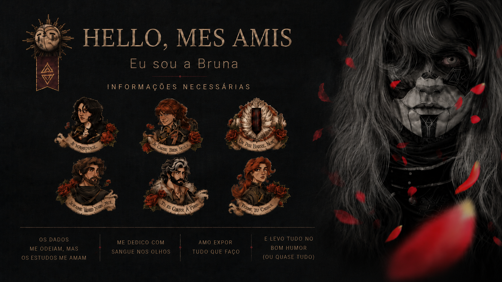

  

 

## ✨ Mais alguns detalhes dessa expedicionária

- 🎓 Estudante de **Sistemas de Informação**
- 💻 Minha primeira experiência com programação foi pelo **front-end**
- ☕ Atualmente meu foco principal de estudos é **Java e back-end**
- 🧠 Gosto de aprender na prática: testar, errar, investigar e entender o que aconteceu
- 🎨 Tenho experiência com **Figma, Canva e Photoshop**
- 🎮 Jogos, RPGs, livros, animes, séries ou músicas geralmente acabam virando inspiração para os projetos que crio
- 🚀 Mantendo os estudos de front-end e back-end atualizados, sempre com novos projetos para trazer ao GitHub
 

## 🎯 Skills de expedicionária

  
  
  
  
  

  
  
  

 

## 🕯️Skills em evolução — Level Up

Atualmente estudando e fortalecendo minha base em:

  
  
  
  

 

## 🗺️ Projetos em andamento *(ou coletando pictos pra evoluir)*

### 🎲 Criador de Fichas de RPG — Site
Meu projeto mais ambicioso até agora.

Estou desenvolvendo uma aplicação para jogadores de RPG criarem e organizarem suas próprias fichas.  
A ideia é transformar esse projeto em uma aplicação **full-stack**, juntando o front-end que já venho estudando com tudo que estou aprendendo sobre back-end.

`Front-end` `Back-end` `Em desenvolvimento`

---

### 🕷️ Spiderverse API
Uma API que comecei do zero inspirada no universo do **Homem-Aranha e seu multiverso**.

Além da programação, estou criando toda a ideia do projeto: estrutura, entidades, nomes, informações e regras. É um projeto que uso principalmente para praticar Java enquanto construo algo relacionado a um universo que gosto.

`Java` `API REST` `Back-end` `Em desenvolvimento`

---

### 🏦 Projeto Banco
Projeto que estou utilizando para estudar fundamentos de back-end e regras de negócio.

A ideia original foi criada pela minha noiva, desenvolvedora sênior de software, para uma mentoria de programação que ela realizou alguns anos atrás. Agora estou reconstruindo o projeto durante meus estudos para entender cada etapa da aplicação.

`Java` `Lógica de Programação` `Back-end` `Em desenvolvimento`

 

## 📜 Minha jornada até aqui

Comecei estudando desenvolvimento pelo **front-end**, principalmente HTML, CSS e JavaScript.

Quando decidi sair um pouco do front e conhecer o back-end, a mudança foi bem maior do que eu imaginava. Com Java comecei a enxergar código, estrutura e até os erros de uma forma completamente diferente.

Foi também quando comecei a perceber que aprendo muito melhor criando coisas do que apenas consumindo teoria.

Hoje, meus projetos acabam sendo uma mistura das duas coisas que mais funcionam para mim:

> **aprender algo novo + construir algo que eu realmente tenha vontade de ver funcionando.**

 

<!--
## 💫 Estatísticas da Expedição

  

  

 
-->

## ⚔ Contatos para duelos *(ou para conversar)*

  

  

 

---

### ✦ *Para aqueles que vieram depois... Quando um código cai, a expedição continua.*

